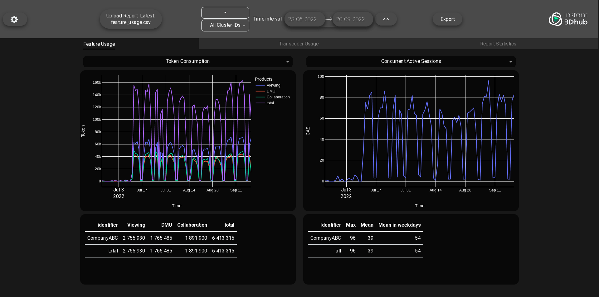

# BI Dashboard

## Description
This web-based dashboard provides a user-friendly interface, incorporating graphs and statistics to provide extensive visualization of the usage of tokens over time. The dashboard enables identification of usage patterns of the product, by comparing data from multiple customers across multiple cluster IDs. The analysis can be exported to a PowerPoint at any time.

The BI dashboard was developed for the Threedy GmbH.

### Visuals

## Installation + Usage
This project uses standard python venv and was tested with **python 3.10.6**

### Starting the Dashboard
#### Using boot files
- Windows: Open the `start(Windows).bat` file to start the dashboard
- Linux: Use `source start(Linux).sh` in the terminal to start the dashboard

#### Using the terminal
For Linux: every step should be performed in the project root directory:
1. Create virtual environment: `python3 -m venv venv`
2. Activate the virtual environment: `source venv/bin/activate`
3. Install all packages: `pip install -r requirements.txt`
4. Deactivate the virtual environment: `deactivate`

Run the app:
1. Activate venv: `source venv/bin/activate`
2. Run the app: `python3 main.py`

### CSV Files
If the column names in the CSV file change, you need to adjust the [csv_config.py](csv_config.py) file. You will find all instructions in the comments there.

### Requirements for the export template
- The template must contain a cover sheet. The order of the PowerPoint shapes must not differ from the current template.
- Slide layouts are used to generate additional slides:
    - The 3rd slide layout should contain a table placeholder and a picture placeholder (See template: "bi_tab_pic", for e.g. "Token Consumption")
    - The 4th slide layout should contain only a picture placeholder ("bi_pic_only")
    - The 5th slide layout should contain only a table ("bi_tab_only", for e.g. "License Usage"). The picture placeholders should have a format of 7:5.

The presentation can be changed as desired after generation. For more information, see the implementation (`dash_app/interaction.py: export_data(...)` and `vis/prs_lib.py`). The template can be found at `assets/report_analysis_template.pptx`

## Authors
Bachelorpraktikum 2022 TU Darmstadt Gruppe 21

## License
This project has a MIT License: [LICENSE](LICENSE)

## Committing code
Before committing code check the code quality: `make quality`

Files can be formatted automatically: `make format`
